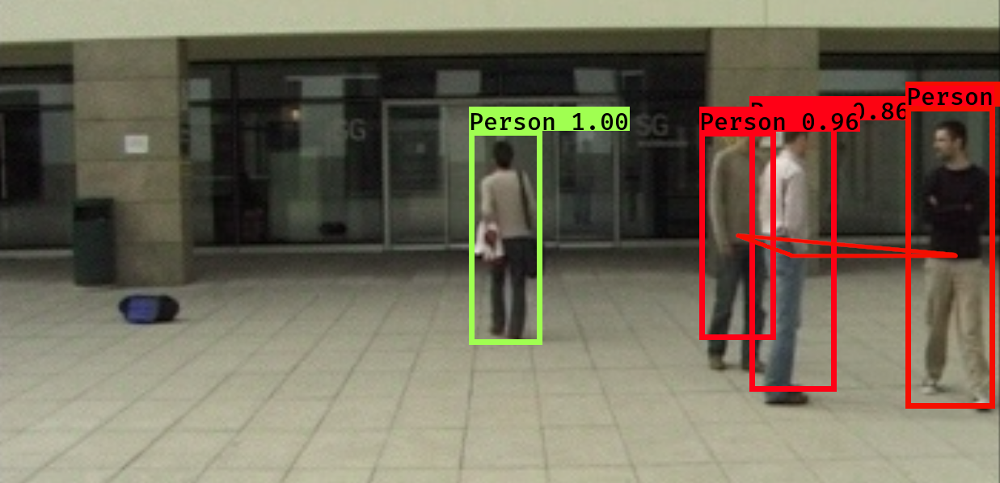

# Social-Distancing-YOLO

Due to the Corona crisis, several governments have decided to implement restrictions for social distance.

The overall goal of this project is to identify people who are following social distancing guidelines and those who are not. This is accomplished by way of the following:

+ Identifying people in images
+ Calculate real world distances between them, directly from the image
+ Detect those that do not follow social distancing guidelines
+ Visualize the results on the camera image

### Pipeline Overview

To build and test your YOLO object detection model and monitor social distancing follow the below steps:

1. [Image Annotation](/1_Image_Annotation/)
    - Annotate images
2. [Training](/2_Training/)
 	  - Download pre-trained weights
 	  - Train your custom YOLO model on annotated images 
3. [Inference](/3_Inference/)
 	  - Detect people in new images and videos and 
    - Monitor the distance between them
4. [Evaluation](/4_Evaluation/)
    - Evaluate the accuracy of the model for human detection

## Repo structure

+ [`1_Image_Annotation`](/1_Image_Annotation/): Scripts and instructions on annotating images
+ [`2_Training`](/2_Training/): Scripts and instructions on training your YOLOv3 model
+ [`3_Inference`](/3_Inference/): Scripts and instructions on testing your trained YOLO model on new images and videos
+ [`4_Evaluation`](/4_Evaluation/): Scripts and instructions on evaluating the results of the trained model
+ [`Data`](/Data/): Input Data, Output Data, Model Weights and Results
+ [`Utils`](/Utils/): Utility scripts used by main scripts

## Getting Started

### Requisites
The only hard requirement is a running version of python 3.6 or 3.7. To install python 3.7 go to [python.org/downloads](https://www.python.org/downloads/release/python-376/).

and follow the installation instructions. Note that this repo has only been tested with python 3.6 and python 3.7 thus it is recommened to use either `python3.6` or `python3.7`.

To speed up training, it is recommended to use a **GPU with CUDA** support. For example on [AWS](/2_Training/AWS/) you can use a `p2.xlarge` instance (Tesla K80 GPU with 12GB memory). Inference is very fast even on a CPU with approximately ~2 images per second. If you want to use your own machine, follow the instructions at [tensorflow.org/install/gpu](https://www.tensorflow.org/install/gpu) to install CUDA drivers. Make sure to install the [correct version of CUDA and cuDNN](https://www.tensorflow.org/install/source#linux). 

### Installation

Install required packages via:

```bash
pip install -r requirements.txt
```
## Full Start (Training and Inference)

To train a YOLO object detector and monitor social distancing  follow the instructions detailed in the three numbered subfolders of this repo:
- [`1_Image_Annotation`](/1_Image_Annotation/),
- [`2_Training`](/2_Training/) and
- [`3_Inference`](/3_Inference/).

Each `*.py` script has various command line options that help tweak performance and change things such as input and output directories. All scripts are initialized with good default values that help accomplish all tasks as long as the original folder structure is preserved. To learn more about available command line options of a python script `<script_name.py>` run:

```bash
python <script_name.py> -h
```

### Multi-Stream-Multi-Model-Multi-GPU
If you want to run multiple streams in parallel, head over to [github.com/bertelschmitt/multistreamYOLO](https://github.com/bertelschmitt/multistreamYOLO).

## Example



## Authors

+ Constantinos Demetriou
+ George Hadjiantonis
+ Mikhail Konstantinou

## License

This work is licensed under a [Creative Commons Attribution 4.0 International License][cc-by].

## References

+ [TrainYourOwnYOLO: Building a Custom Object Detector from Scratch](https://github.com/AntonMu/TrainYourOwnYOLO)
+ [YOLOv3](https://pjreddie.com/darknet/yolo/)